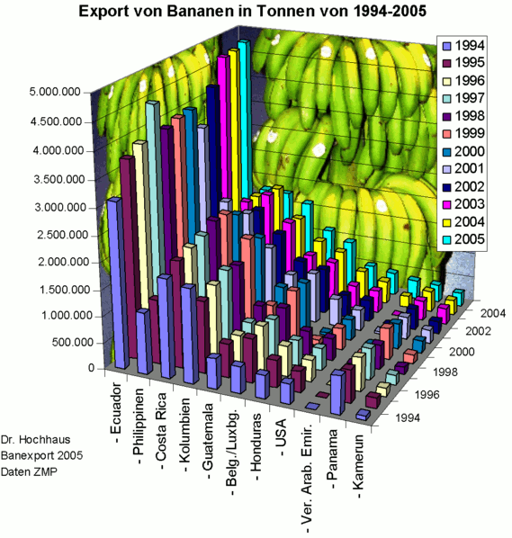

In this section, we'll learn the basics of data visualization. 

[TOC]

## What is data visualization?
Data visualization is everywhere. You can hardly turn on the TV, open a book or a new tab without seeing data being visualized. Infographics are prominent examples of data visualization. Using images to represent data can help people translate the information into something they better understand. Commons forms of data visualizations are charts and graphs but maps are also data visualization. In fact, geographic data is so specialized that we will spend an entire unit focusing just on mapping.  

> Can you think of a favorite example of good data visualization? What about a terrible example? What made the visualization work? How did you feel when you realized the visualization was flawed? 

*[The Historian's Macroscope](http://www.themacroscope.org/)* defines data visualization like this: 

> "A method of deforming, compressing, or otherwise manipulating data in order to see it in new and enlightening ways. A good visualization can turn hours of careful study into a flash of insight, or can convey a complex narrative in a single moment... Visualizations can also lie, confuse, or otherwise misrepresent if used poorly." - [The Historian's Macroscope](http://www.themacroscope.org/?page_id=837)

Visualization has been happening in the humanities for a long time - well before computers. Charles Minard's 1869 chart showing the number of men in Napoleon’s 1812 Russian campaign army is often cited as an early example.

[Charles Joseph Minard](https://en.wikipedia.org/wiki/Charles_Joseph_Minard)

If you're interested in the history of information visualization, look up [Edward Tufte](https://www.edwardtufte.com/) and his work, *The Visual Display of Quantitative Information*. 

## Why visualize? 
It is easy to fall into a trap of visualizing data because you can. Data visualization is new and shiny and looks great on a Powerpoint slide in front of an audience. Before you fill up that slidedeck, take some time to evaluate why you're visualizing. Are there aspects of the data that are confusing or difficult to describe? Does the visualization reinforce your point? Does it show something in a new way? Have you selected the right visualization for what you're trying to share? Visualizations can be powerful, just make sure you're using them for good. 

Before you get to the point of communicating your findings to an audience, data visualization can play a key role in helping you understand and assess your data. Visualization tools can test your assumptions about your data or draw attention to errors you might have missed. If you're dealing with a 19th century topic, but the first entry in time is in the 17th century, you may have a 6 instead of a 9 somewhere in your data. You should not hesitate to visualize your data before it's done being collected or cleaned. It's very likely that the visualization will offer up a new way of thinking about your methods.  

## What makes a good visualization?
Think back to my question about a favorite example of good visualization? What made it good? How did you know it was effective? Maybe it's easier to think about a bad visualization and reverse engineer. 

This is a laughably bad visualization. But why? Take a second to make a list. Mine looks like this:

* distracting bananas
* 3D columns, they obscure each other, not to mention I can't tell the quantity they represent.
* years are already on an axis, do I need the colors? And the legend? 
* country names are hard to read. 
* colors are very similar  

From this list, I could speculate that principles of good visualization might be: 

* minimal decoration. 
* flat, not three-dimensional.
* clear, legible labels.
* color choices that take into account the prevalence of [color blindness](http://www.themacroscope.org/?page_id=880).
* appropriate chart type. 
* balanced scale and axises. 
* meaningful legend and explanatory title and text. 

Good visualizations are built with accessibility issues in mind and improve the value of the visualization for everyone. Read [accessible data viz is better data viz](http://www.storytellingwithdata.com/blog/2018/6/26/accessible-data-viz-is-better-data-viz) and consider the principles it suggests when you are evaluating and creating visualizations.  

I walk you through this exercise in hopes that you can use it on other visualizations you encounter. It's easy to look at a list of best practices, it's a little more challenging to apply those practices to your own work or the work of others. 

## Types of visualizations

There are many types of charts and options for visualizing data. Here is a quick list of the most common, along with links to more thorough lists.

* Bar or column chart - useful for comparison of values across categories. 
* Heatmap - uses color variance to show difference in values. Often seen in maps.
* Infographics - can include data visualizations, but mostly just present info in a visual way.
* Line graph - shows quantitative values over time or other interval. 
* Pie graph - Show proportions of a whole. 
* Scatterplot - Data points are arranged by relationship to two variables.
* Tree map - shows hierarchy and size of each value. 

[Data Visualization Catalogue](https://datavizcatalogue.com/index.html) is a great resource for learning more about chart types. It allows you to select by chart type of type of data being visualized. 

## How do I do it? 

There is no one perfect tool for data visualization. Spreadsheet software like Excel and Google Sheets, as well as programming languages or analysis tool, all have their own methods for creating visualizations. You may also find standalone tools that take your data and produce visualizations. The nature of your project, your data, and the goals of your visualizations will dictate the tools you use. 

If you're just starting out, use Excel or Google Sheets to get comfortable. If you're ready for the next level, try [RAW Graphs](https://rawgraphs.io/). [Tableau Public](https://public.tableau.com/en-us/s/) is the free version of what is quickly becoming industry standard software. If you feel ready for advanced work, check out [D3.js](d3js.org/), a JavaScript library for creating data-driven documents. 

## Activities

### Activity 4.1

Before you start making your own visualizations, let's practice improving on existing visualizations. This activity focuses on the mechanics and aesthetics of visualizations.

Groups: 

1. Nayongi, Kaitlyn, Amanda, Lily
2. Emma, Caitlyn, John, George
3. Kit, Gavron, Maya, Quinn
4. Elizabeth, Merrill, Richard
5. Gabe, Mary Beth, Mark

*** 

1. Visit [viz.wtf](https://viz.wtf/) or [HelpmeViz](https://policyviz.com/helpmeviz/). 
2. Browse the examples, then pick 1-2 visualizations to analyze as a group. 
3. Answer the following in a [Box note](https://wlu.app.box.com/folder/147257344438) for your group. You will turn this in as homework this week!
	* First, link or embed your visualization or set of visualizations. List the names in your group. 
	* What type of visualization is this? (Bar chart, line graph, etc?)
	* What was the intended goal of this visualization?
	* What went wrong? Be specific! List as many things as possible.
	* How could this visualization be improved? Be specific! 
	* Finally, using the materials provided, construct an improved version of this visualization. Snap a photo and add it to your Box note.

### Activity 4.2

Let's also make sure you can think critically about professional visualizations that are designed to persuade. This activity focuses on the audience and argument of visualizations. Go out into the wilds of the internet and find a visualization that speaks to you. Answer the following on your own. You will be turning in a more developed answer as homework.

* What is this visualization trying to convey? Is it successful? Does it convince you? Why or why not? Would the piece work without the visualization?
* Does the style suit the data? What other visualization styles would work?
* Who made this visualization? What is their background?
* Who is the audience and what is the context? 
* What is source of the data of this visualization? Can you find the original data set? Where did you look? What format is it in? 
* What else could be done with this data set? Other research questions? Other visualizations?
* Can you attempt to recreate this visualization? Improve on it? What tools/skills would you need?

### Activity 4.3

Now it's time to try your hand at creating your own visualization. Let's start with the Coeducation Report data set. You can use this [assembled data set](https://wlu.app.box.com/file/868731673760) or work on the one we assembled in [Google Sheets](https://docs.google.com/spreadsheets/d/1A8TL_uhRV5Y1XCLmXtR7IMFo_-Y7uhhyiSnjyybfNKE/edit?usp=sharing). Don't forget to download it to your own computer, so you don't alter the data for anyone else. 

1. Brainstorm some potential visualizations. What do you want to communicate about this data set? What's interesting about it? How can a visualization help show an intriguing or important part of this data? 
2. Narrow your list down to one or two ideas. What type of visualizations are you interested in using and how will they help you get at the information you want to convey? It might help to draw your viz on paper first so you have an idea of what you want to create. 
3. Use Excel (see next section for a short tutorial) or Google Sheets to create a basic graph. Are you happy with it? Why or why not? How do different types of graphs change your understanding of the data? Try creating the same graph in both programs to see if there are any differences. 
4. If you're still not happy with your graph, try [Raw Graphs](https://rawgraphs.io/). There are some wild options, is your graph still legible? 

For your blog post this week, go through this same process with the Cemetery data set. You may have to clean up fields in Open Refine or Excel to get the results you're looking for. Post several visualizations, along with a 300-400 word blog post on your results. What is your goal with these visualizations? How do they help you understand the data? How did you put these graphs together? Did you have to clean the data or look up how to create the graph? What did you struggle with? Are you happy with the results? What might you want to do with more time/skills? 

#### Excel + Pivot Tables

* To create a graph in Excel, select all the columns in your data set. From the Insert tab, select PivotChart. You can accept the defaults to open a new tab in your spreadsheet.
* The new tab will have a window called PivotTable fields. It contains a list of fields, then four windows: Filters, Legend (Series), Axis (Categories), and Values. Dragging fields into these categories will create your graph. You can drag the same field into multiple sections or drag multiple fields into different sections to alter the graph.
* For example, I can create a very basic bar graph that shows how many people support/opppose/don't care about coeducation by dragging the "opinion" field into the Values box (so it counts the number of entries) and the Axis box (so it shows the different answers). What happens when I drag opinions into the Legend box instead? 

## Resources
* [ColorBrewer](http://colorbrewer2.org/) - tool for creating distinct color palettes
* [Data Viz Catalogue](https://datavizcatalogue.com/)
* [Raw Graphs](https://rawgraphs.io/)

## Readings
* [Data + Design: A simple introduction to preparing and visualizing information](https://orm-atlas2-prod.s3.amazonaws.com/pdf/13a07b19e01a397d8855c0463d52f454.pdf)
* [The Historian's Macroscope - Making Your Data Legible: A Basic Introduction to Visualizations](http://www.themacroscope.org/?page_id=837) and subsequent sections
* [The Pudding](https://pudding.cool/) - data-driven visual essays

